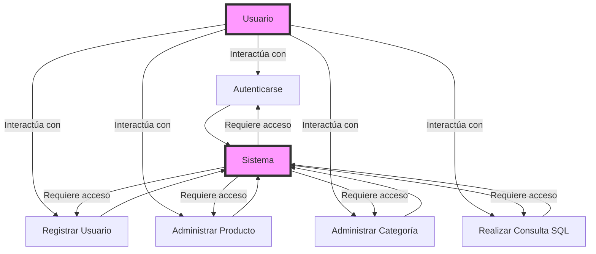
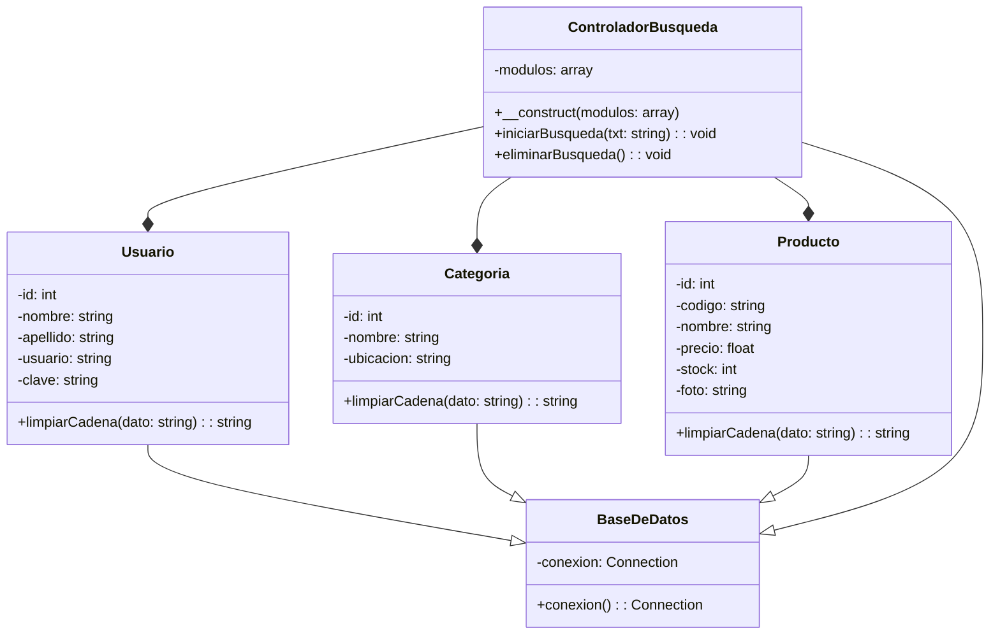

# Sistema de Gestión de Inventario en PHP

## Resumen

En un entorno donde la eficiencia y precisión en el control de inventario son fundamentales para el éxito de una organización, este proyecto se centra en desarrollar un sistema de gestión de inventario en PHP que permite agregar usuarios, categorías y productos, así como listarlos de manera organizada según las necesidades específicas de la empresa. El objetivo principal es mejorar la eficiencia operativa y la toma de decisiones informadas a través de la automatización y organización del proceso de gestión de inventario.

## Antecedentes o introducción

En el contexto actual, se ha implementado con éxito un sistema de gestión de inventario en PHP que permite agregar usuarios, categorías y productos, así como listarlos de manera organizada según las necesidades específicas de la empresa. Este sistema ha mejorado significativamente la eficiencia operativa y la toma de decisiones informadas en relación con el inventario.

## Planteamiento del problema

### Problema

Durante la evaluación exhaustiva de nuestro sistema actual de gestión de inventario, hemos identificado varios problemas críticos que están afectando negativamente nuestra eficiencia operativa y nuestra capacidad para tomar decisiones informadas:

- Ineficiencia y pérdida de tiempo en el registro y seguimiento del inventario.
- Probabilidad de errores humanos debido a métodos manuales.
- Falta de visibilidad y control centralizado del inventario.
- Dificultad para análisis y generación de informes sobre el inventario.

### Justificación

La implementación de un sistema automatizado y centralizado de gestión de inventario se justifica por varios motivos fundamentales que abordan directamente los problemas identificados y benefician a la organización en múltiples aspectos:

- Optimización de Procesos y Reducción de Errores.
- Mejora en la Toma de Decisiones y Gestión de Recursos.
- Ventaja Competitiva y Experiencia Mejorada para Clientes.
- Eficiencia en la Toma de Decisiones y Análisis Estratégico.

## Objetivos

### General

Desarrollar e implementar un sistema de gestión de inventario en PHP que permita gestionar eficientemente los registros de usuarios, categorías, productos y movimientos de inventario, con el fin de mejorar la eficiencia operativa y la toma de decisiones informadas dentro de la organización.

### Específicos

- Diseñar una Interfaz de Usuario Intuitiva.
- Gestión Eficiente de Inventarios.
- Organización y Visualización del Inventario.
- Seguridad y Acceso Controlado.
- Desarrollo de Funcionalidades Específicas.
- Integración con Herramientas de Análisis y Seguridad.
- Pruebas Continuas de Seguridad y Calidad.
- Capacitación y Soporte.

## Referentes teóricos

### Diagramas de Casos de Uso

- Autenticarse
- Registrar Usuario
- Administrar Producto
- Administrar Categoría
- Realizar Consulta SQL

### Diagrama de Clases

### Diagrama de Componentes y Arquitectura

## Desarrollo de la propuesta

### Tecnología de información

#### SonarSource

- Paso 01: Creación de un repositorio público en GitHub.
- Paso 02: Configuración de SonarCloud para análisis de calidad de código.
- Paso 03: Configuración del repositorio en SonarCloud.
- Paso 04: Selección de la versión anterior del código para análisis.
- Paso 05: Análisis de código realizado por SonarSource.
- Paso 06: Resolución de vulnerabilidades detectadas.

### Metodología, técnicas usadas

#### SonarSource

- Problema en index.php.
- Problema en principal.php.
- Problema en categoria_producto.php.
- Problema en product_img.php.